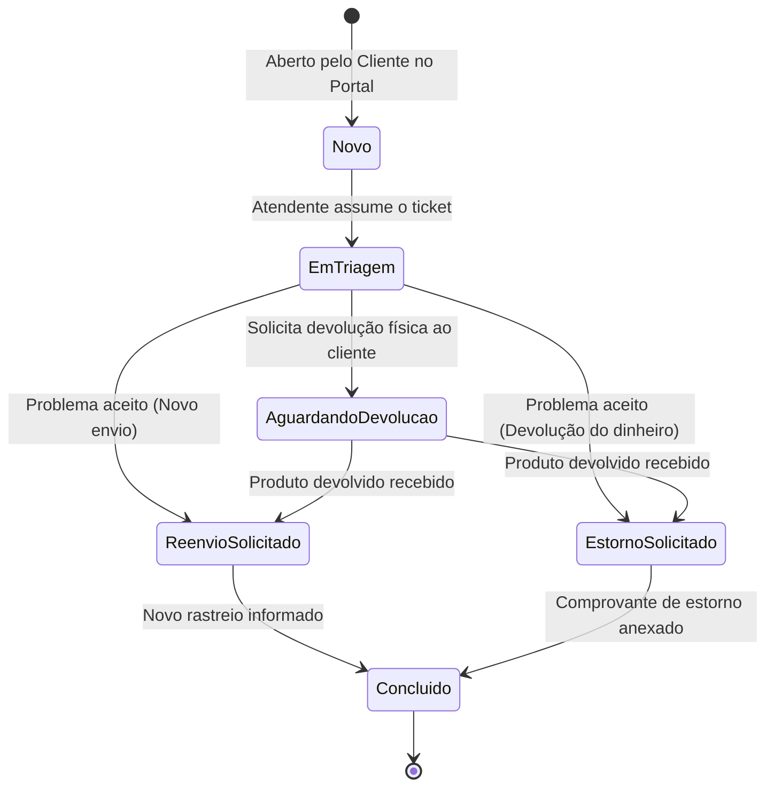

# PosTec — Definição do Escopo de MVP
**Disciplina:** Startup Project: One — Facens (ADS, 4º Semestre)  
**Projeto:** PosTec — SaaS de Gestão de Pós-Venda para Pequenos e Médios E-commerces  
**Data da Definição:** 06/10/2026  

---

## 1. Visão Geral e Posicionamento do MVP

O **PosTec** é um mini-helpdesk especializado em pós-venda que resolve a dispersão de reclamações (hoje espalhadas em WhatsApp, DMs do Instagram e planilhas). 
O foco do MVP não é construir automações logísticas/fiscais complexas nem integrar com ERPs de forma profunda logo de cara, mas sim **centralizar o ciclo da ocorrência em uma esteira única e transparente**, dando à dona do e-commerce (Mariana) visibilidade e controle sobre reenvios e estornos.

---

## 2. Escopo do MVP: O que entra vs. O que fica de fora

### ✅ DENTRO DO ESCOPO (Core Funcional)
1. **Portal Público de Autoatendimento do Cliente Final:**
   - Link direto/página acessível pelo cliente da loja (sem login complexo, apenas informando CPF/E-mail e Número do Pedido).
   - Formulário de abertura de ocorrência com motivo pré-definido (Avaria, Arrependimento, Tamanho Incorreto, Atraso de Entrega), descrição e upload de foto/evidência.
2. **Painel Administrativo da Loja (Helpdesk Interno):**
   - Fila Kanban / Tabela de Ocorrências filtradas por status.
   - Detalhe da ocorrência com linha do tempo de mensagens/histórico entre atendente e cliente.
   - Transição de status da ocorrência com máquina de estados definida.
3. **Módulo de Resolução Informativa:**
   - Fechamento da ocorrência categorizado em **Reenvio** ou **Estorno**:
     - **Reenvio:** registro do novo código de rastreio e itens reenviados.
     - **Estorno:** registro do valor estornado e comprovante/ID da transação financeira.
4. **Notificações Transacionais Reais por E-mail (via Resend):**
   - Disparo automático de e-mails reais para o cliente final e para a loja nos momentos-chave:
     - Confirmação de abertura de chamado com link de acompanhamento.
     - Atualização de status da ocorrência.
     - Notificação de encerramento com novo código de rastreio ou comprovante de estorno.
   - Implementado via chamada simples à API do Resend (camada gratuita de 3.000 e-mails/mês, sem necessidade de configurar servidor SMTP).
5. **Multi-Tenancy Pragmático & Autenticação:**
   - Cadastro básico de Loja (`tenant`) e usuário Administrador/Atendente.
   - Autenticação via JWT com isolamento por `tenant_id` no banco de dados.
   - Exibição visual do plano contratado (Starter/Pro) sem gateway de pagamento real integrado no MVP.
6. **Mock/Simulação de Pedidos:**
   - Tabela interna de pedidos pré-cadastrados ou consulta mockada para validar se o pedido existe ao abrir a ocorrência.

---

### ❌ FORA DO ESCOPO DO MVP (Roadmap Futuro)
- **Integração com WhatsApp (Meta Cloud API):** Substituído no MVP por e-mails reais via Resend. A integração oficial com WhatsApp fica para a fase comercial de expansão (evita aprovação burocrática de templates na Meta, cobrança em dólar por conversa e risco de instabilidade/bloqueio durante a demo da banca).
- **Integrações reais profundas de ERP/E-commerce (Bling, Yampi, Shopify, Nuvemshop):** O sistema não fará polling nem chamadas reais no MVP; a base de pedidos é simulada localmente.
- **Automação logística real com transportadoras:** Sem geração automática de etiquetas reversas (Correios/Melhor Envio) — o atendente apenas cola o rastreio.
- **Gateway de Pagamento de Assinatura:** Sem integração com Stripe/Asaas para cobrar o lojista no MVP.
- **Convite de equipe por e-mail com tokens temporários:** Usuários adicionais são criados diretamente pelo Admin na interface.

---

## 3. Máquina de Estados da Ocorrência

O ciclo de vida da ocorrência segue uma esteira linear e transparente:



### Regras de Transição e Papéis
- **Cliente:** Pode abrir o chamado e responder mensagens/enviar comprovantes.
- **Atendente:** Pode mudar o status para triagem, solicitar devolução, registrar reenvio/estorno e concluir.
- **Diferenciação Reenvio vs. Estorno:**
  - `Reenvio`: exige `novo_codigo_rastreio` e `itens_reenviados`.
  - `Estorno`: exige `valor_estornado` e `id_transacao_estorno` / comprovante.

---

## 4. Stack Tecnológica e Arquitetura

- **Back-end:** Node.js + TypeScript + Express.
- **Banco de Dados:** PostgreSQL rodando em container Docker.
- **Conexão com Banco:** Pool nativo (`pg` / `node-postgres`), sem ORMs pesados (foco em queries SQL diretas e controle de performance).
- **Serviço de E-mail:** Resend SDK / API REST.
- **Front-end:** React + TypeScript (Vite) + Tailwind CSS (ou shadcn/ui).
- **Arquitetura Multi-Tenant:** Base de dados compartilhada com discriminação lógica por coluna (`tenant_id` em todas as tabelas de loja).

```mermaid
flowchart TD
    subgraph Cliente Final
        P[Portal de Autoatendimento]
    end

    subgraph Equipe da Loja (Mariana e Atendentes)
        D[Painel Web PosTec]
    end

    subgraph Backend
        API[API Express + TypeScript]
        Auth[Middleware JWT & TenantID]
        EmailService[Serviço Resend API]
    end

    subgraph Infra & Externos
        PG[(PostgreSQL em Docker)]
        Resend[(Resend Email Service)]
    end

    P -->|Cria Ticket / Consulta Status| API
    D -->|Gerencia Ocorrências / Resoluções| Auth
    Auth --> API
    API -->|Pool nativo 'pg'| PG
    API -->|Notificações| EmailService
    EmailService -->|Disparo Real| Resend
    Resend -->|Recebe E-mail| ClienteEmail[Caixa de Entrada do Cliente]
```

---

## 5. Validação do Problema e Estratégia de Apresentação (Pitch)

### Comprovação do Problema (Customer Discovery)
1. **Entrevistas Reais Realizadas:**
   - Conversa com o gerente de e-commerce de minoxidil.
   - Conversa com o proprietário de grande e-commerce em Laranjal Paulista.
   *(Inserir no pitch as dores reais coletadas: tempo gasto respondendo clientes repetidamente, prejuízo com devoluções desordenadas e falta de métricas).*
2. **Dados Secundários de Mercado:**
   - Relatórios da ABComm e Ebit demonstrando que o volume de logística reversa e trocas no e-commerce de moda varia entre 15% e 30% dos pedidos.

### Roteiro da Demonstração (Demo na Banca)
1. **Ato 1 (Cliente):** O avaliador acessa o Portal do Cliente, digita o número de um pedido com defeito e o seu e-mail pessoal. Envia a solicitação em 1 minuto.
2. **Ato 2 (Disparo Real):** O avaliador recebe imediatamente o e-mail: *"Recebemos seu chamado #104"*.
3. **Ato 3 (Atendente):** A Mariana entra no PosTec e vê a ocorrência no topo da lista "Novo". Ela assume o caso, conversa pelo histórico e marca "Reenvio Solicitado".
4. **Ato 4 (Resolução):** O atendente insere o novo código de rastreio e fecha o chamado como "Concluído". O cliente recebe o e-mail de confirmação com o rastreio.

---

## 6. Divisão do Trabalho na Equipe (6 Integrantes)

Para evitar gargalos onde front-end fica travado esperando back-end:

| Integrante / Função | Responsabilidades Chave no Semestre |
| :--- | :--- |
| **André Borges (Dev Back-end)** | Configuração do Docker/PostgreSQL, estrutura do pool `pg`, rotas da API, regras de negócio da máquina de estados, autenticação JWT com `tenant_id` e integração Resend. |
| **Luiz (Dev Front-end)** | Estrutura do projeto React/Vite, telas do Portal do Cliente, Kanban/Tabela do Painel do Lojista, componentes de chat/histórico. |
| **Banco de Dados & Gestão** | Modelagem ER (Entidade-Relacionamento), scripts DDL/migrações SQL, gestão do quadro Trello, atas e cronograma do projeto. |
| **UX/UI** | Fluxos de usuário no Figma (Portal mobile-first para o cliente final e Dashboard desktop para o lojista), design system e guia de estilos. |
| **Documentação & Requisitos 1** | Documentação de requisitos funcionais/não-funcionais, regras de negócio e escrita da documentação acadêmica da disciplina. |
| **Documentação & Requisitos 2** | Estruturação dos dados de validação (transcrições das entrevistas e dados de mercado), montagem dos slides do Pitch e preparação do roteiro da demo. |

> **Acordo dos Desenvolvedores:** André e Luiz atuarão como fullstack cooperativos. André foca no core da API e Luiz no core do front, mas ambos compartilham o contrato de API (JSONs de exemplo acordados na 1ª semana) para que o front mocke respostas enquanto o back sobe as rotas reais.

---

## 7. Riscos e Questões a Alinhar

### Riscos Identificados e Mitigações
1. **Risco:** Usar pool nativo do PostgreSQL sem migrations automáticas (ex: Prisma/Knex) pode causar divergência de tabelas entre os membros.  
   *Mitigação:* A pessoa de Banco de Dados deve manter um arquivo centralizado de scripts SQL versionados (`schema.sql` ou pasta `migrations/`) no repositório.
2. **Risco:** WhatsApp deixar de ser implementado e a banca cobrar "onde está a integração prevista no pitch?".  
   *Mitigação:* Deixar explícito no pitch que no MVP o cliente é atendido via Portal Web transparente com notificações transacionais reais por E-mail (Resend), e que o WhatsApp Cloud API está mapeado no roadmap de Go-To-Market pós-MVP.

### Perguntas para Levar ao Grupo / Professor
1. **Para o Professor:** *"Professor, para a nota máxima da disciplina, o MVP precisa ter uma API externa de e-commerce real plugada (ex: Nuvemshop ou Melhor Envio), ou o fluxo completo ponta-a-ponta funcionando com dados simulados/mockados atende o critério de MVP funcional?"*
2. **Para o Designer UX/UI:** *"Podemos priorizar o design do Portal do Cliente em formato mobile (já que 80% dos clientes acessam pós-venda pelo celular) e o Painel do Lojista em formato desktop?"*
3. **Para a pessoa de Banco de Dados:** *"Quando você consegue nos entregar o script inicial das tabelas `lojas`, `usuarios`, `pedidos`, `ocorrencias` e `mensagens_historico` para subirmos no Docker?"*
